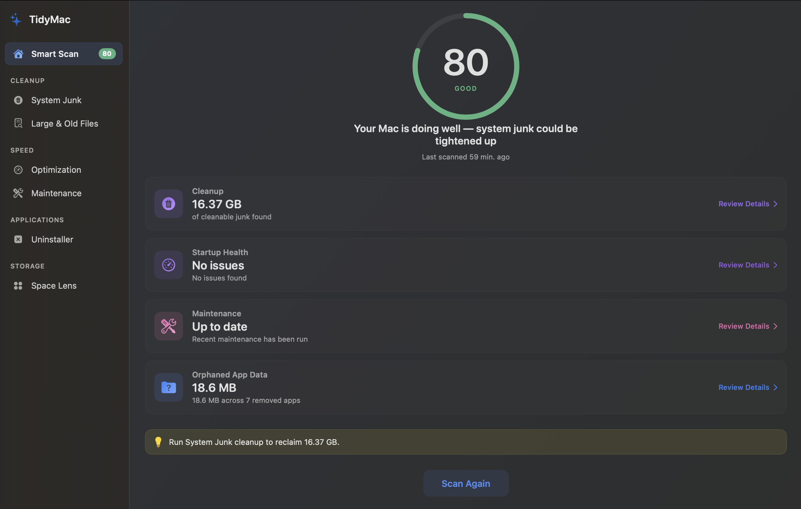
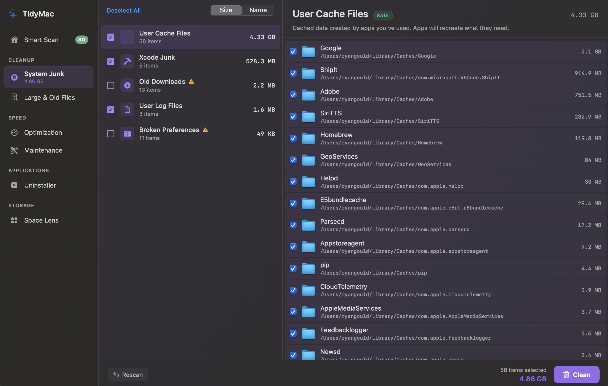
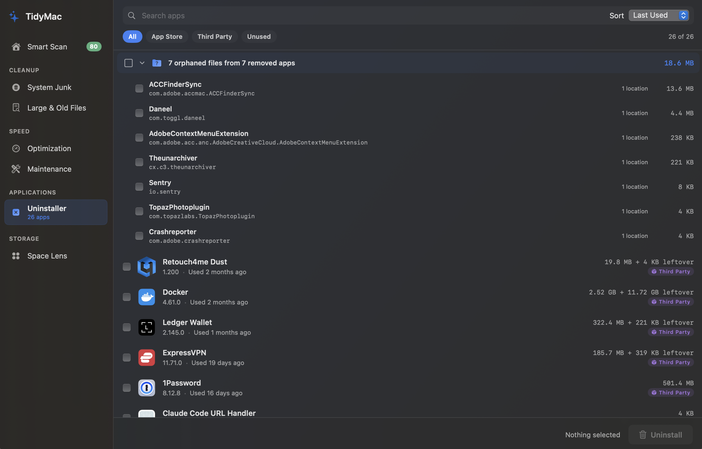
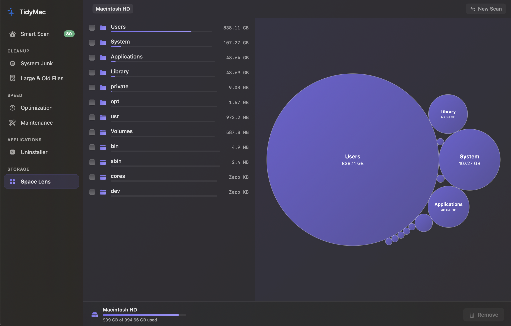
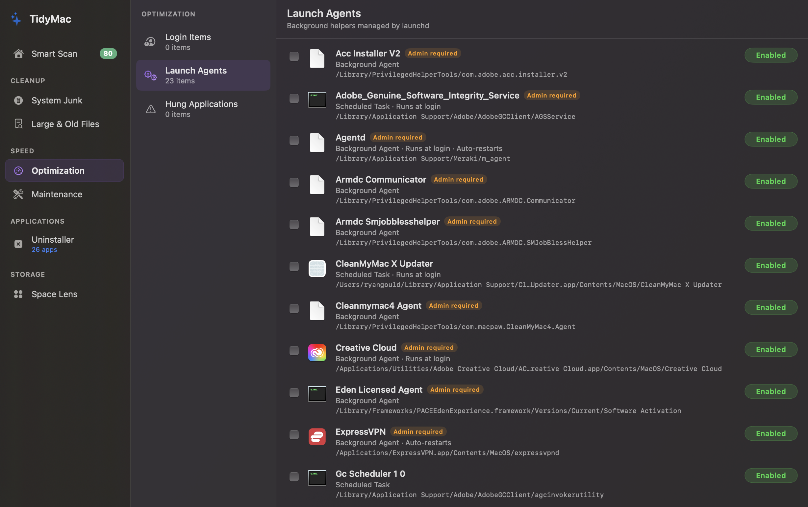
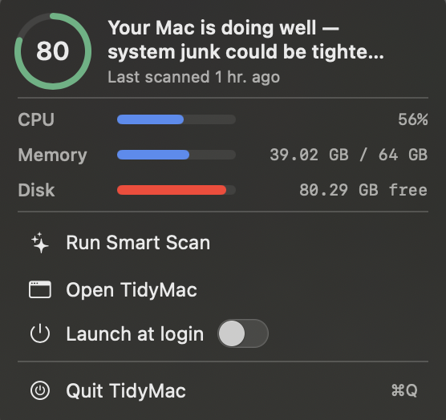

# TidyMac

A free, open-source Mac maintenance tool. Clean system junk, manage startup items, uninstall apps completely, and visualize disk usage — without a subscription.

TidyMac does what CleanMyMac does, transparently. Every file it finds is explained. Every action is logged. The source code is right here.



---

## Features

**System Junk Scanner** — Finds and removes caches, logs, temporary files, Xcode build artifacts, old iOS device backups, and broken preferences. Only surfaces items it can actually delete — no false promises, no failed cleanups.



**App Uninstaller** — Removes apps and all their associated files (preferences, caches, application support, launch agents, containers, saved state). Finds orphaned files from apps you already deleted. Confidence-scored matching ensures nothing gets removed by mistake.



**Space Lens** — Interactive circle-packing visualization of your disk usage. Click into directories to explore where your storage goes. Select items for removal directly from the visualization.



**Optimization** — Manages login items and launch agents. Flags broken agents (executable missing), orphaned agents (parent app uninstalled), and suspicious agents (unusual executable locations, non-standard labels). Includes security heuristics for anomaly detection.



**Maintenance** — System housekeeping tasks: free up purgeable space, flush DNS cache, reindex Spotlight, rebuild Mail index, clear font caches. Each task shows a dry-run preview before executing.

**Smart Scan** — Runs all modules in sequence with a single click. Produces an honest health score that reflects actual system state — not cache size. Active app caches don't reduce your score because they're supposed to exist.

**Menu Bar Widget** — At-a-glance CPU, memory, and disk usage. Quick access to scan results and cleanup actions. TidyMac persists in the menu bar when the main window is closed.



---

## Installation

### Homebrew (recommended)

```bash
brew tap countingaces/tap
brew install --cask tidymac
```

### Manual Download

Download the latest `.zip` from [Releases](https://github.com/countingaces/TidyMac/releases), unzip, and drag TidyMac to your Applications folder.

This release is not yet code-signed or notarized, so the first launch will hit Gatekeeper:

> **"TidyMac" Not Opened — Apple could not verify "TidyMac" is free of malware…**

This is the standard warning macOS shows for any unsigned app. To get past it:

- **macOS 15 (Sequoia) and later:** Click **Done** on the dialog, open **System Settings → Privacy & Security**, scroll to the "TidyMac was blocked…" row near the bottom, and click **Open Anyway**.
- **macOS 14 (Sonoma):** Right-click TidyMac in `/Applications` and choose **Open** from the context menu.
- **Power users (any macOS):** Strip the quarantine xattr in one command — `xattr -d com.apple.quarantine /Applications/TidyMac.app`.

macOS remembers the decision; subsequent launches don't prompt. This warning will go away entirely once a v0.x release is signed and notarized with an Apple Developer ID.

### Build from Source

Requires Xcode 15+ and macOS 14.0 (Sonoma) or later.

```bash
git clone https://github.com/countingaces/TidyMac.git
cd TidyMac
xcodebuild -project TidyMac.xcodeproj -scheme TidyMac -configuration Release build
```

The built app will be in `build/Release/TidyMac.app`.

---

## Permissions

TidyMac works best with **Full Disk Access** enabled. Without it, the scanner can't see all directories and will report incomplete results.

To enable: System Settings → Privacy & Security → Full Disk Access → add TidyMac.

### Privileged Helper (optional)

Some system files (root-owned caches, system logs, CoreSimulator data) require administrator privileges to remove. TidyMac includes an optional helper tool that runs with elevated permissions to clean these files.

The helper:
- Communicates with TidyMac over XPC with kernel-level code signing validation
- Only deletes files in an explicit allowlist of approved system locations
- Rejects requests targeting protected paths (`/System/`, `/Applications/`, `/usr/`, etc.)
- Resolves symlinks before validation to prevent path traversal attacks
- Can be uninstalled at any time from TidyMac → Settings → Helper Tool

To enable root-level cleanup, building with a Developer ID certificate is required. See [Building the Helper](#building-the-privileged-helper) below.

Without the helper, TidyMac cleans all user-owned files normally. Admin-required items appear with an "Admin" badge and can be skipped.

---

## How TidyMac Compares to CleanMyMac

| | TidyMac | CleanMyMac |
|---|---|---|
| **Price** | Free | $10/month or $48/year |
| **Source code** | Open source (MIT) | Closed source |
| **Malware scanner** | No (out of scope) | Yes (fails EICAR tests) |
| **Scoring** | Honest — active caches don't reduce your score | Inflated — subtracts points for normal cache files |
| **Upsell prompts** | None | Frequent (upgrade, survey, Gemini) |
| **What it cleans** | Shows only items it can actually delete | Shows items that fail silently |
| **Transparency** | Full log of every action, allowlist visible in source | Limited visibility |

TidyMac deliberately omits a malware scanner. Malware detection requires maintaining threat databases and is better handled by dedicated security tools. TidyMac's Optimization module provides lightweight security heuristics (flagging suspicious launch agents) but does not claim to be antivirus software.

---

## Architecture

TidyMac is a native SwiftUI macOS app built with MVVM architecture.

```
TidyMac/
├── Models/              Data structures (FileNode, JunkItem, AppInfo, etc.)
├── ViewModels/          Business logic per module
├── Views/               SwiftUI views organized by module
│   ├── SmartScan/
│   ├── SystemJunk/
│   ├── SpaceLens/
│   ├── Uninstaller/
│   ├── Optimization/
│   ├── Maintenance/
│   ├── LargeFiles/
│   ├── MenuBar/
│   ├── Settings/
│   └── Shared/          Reusable components (CleaningProgressView, etc.)
├── Services/            System interaction layer
│   ├── SystemJunkScanner.swift
│   ├── FileSystemScanner.swift
│   ├── AppDiscoveryService.swift
│   ├── RemnantScanner.swift
│   ├── OrphanDetector.swift
│   ├── OptimizationScanner.swift
│   ├── MaintenanceTasks.swift
│   ├── SmartScanOrchestrator.swift
│   ├── CleaningService.swift
│   ├── HealthScoreCalculator.swift
│   ├── PrivilegedHelperManager.swift
│   └── Protocols/
│       └── ScanModuleProtocol.swift
└── TidyMacHelper/       Privileged helper tool (separate target)
```

Every scan module conforms to `ScanModuleProtocol`, which defines a standard interface for scanning, reporting progress, and executing cleanup. This enables the Smart Scan orchestrator to run all modules through a single pipeline, and allows new modules to be added by implementing one protocol.

The Scanner Protocol enforces safety classification at the type level. Every scannable item has a `SafetyLevel` (.safe, .cautious, .risky) that determines default selection behavior in the UI. Safe items are pre-selected. Cautious items require explicit opt-in. Risky items show warnings.

---

## Building the Privileged Helper

The helper tool requires a valid Apple Developer ID certificate ($99/year) because macOS enforces code signing for privileged helpers at the kernel level.

If you have a Developer ID:

1. Set your signing team in the Xcode project settings for both the TidyMac and TidyMacHelper targets
2. Replace `PLACEHOLDER_TEAM_ID` in `TidyMacHelper/HelperTool.swift`, `TidyMacHelper/Info.plist`, and `ExportOptions.plist` with your actual Team ID
3. Hardened Runtime is already enabled for both targets
4. Build and archive: `./Scripts/build-release.sh` (reads credentials from environment variables — see the script header)
5. The helper embeds in `TidyMac.app/Contents/MacOS/com.tidymac.TidyMacHelper`, with its launchd plist at `Contents/Library/LaunchDaemons/`

Without a Developer ID, TidyMac builds and runs normally — the helper target compiles but can't be deployed. All user-owned cleanup works without it.

---

## Privacy

TidyMac does not collect telemetry, usage data, or analytics. It does not make network requests. It does not phone home. Everything runs locally on your Mac.

Cleaning logs are stored in `~/Library/Application Support/TidyMac/Logs/` and never leave your machine.

---

## Contributing

Contributions welcome. The most impactful areas:

- **New scan categories** — Implement `ScanModuleProtocol` for additional cleanup targets
- **Improved heuristics** — Better detection of orphaned files, suspicious launch agents, or stale data
- **UI polish** — Animations, accessibility, and localization
- **Testing** — Unit tests for scanner logic, especially path validation and safety classification

Please open an issue before starting major work so we can discuss the approach. See [CONTRIBUTING.md](CONTRIBUTING.md) for the build/test workflow.

---

## License

MIT License. See [LICENSE](LICENSE) for details.

---

## Acknowledgments

Built as a computer engineering learning project using [Claude Code](https://claude.ai) for implementation and Claude for architecture and systems design. The project covers OS concepts (file systems, process management, IPC, code signing, privilege escalation), architecture patterns (MVVM, protocols, state machines, orchestration), and macOS platform specifics (launchd, XPC, APFS, Gatekeeper, TCC).
